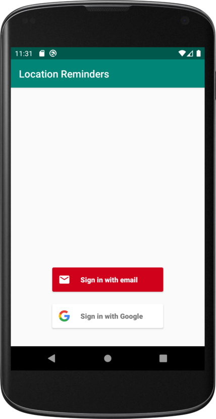
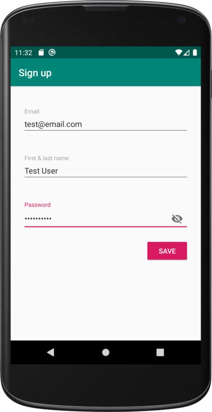
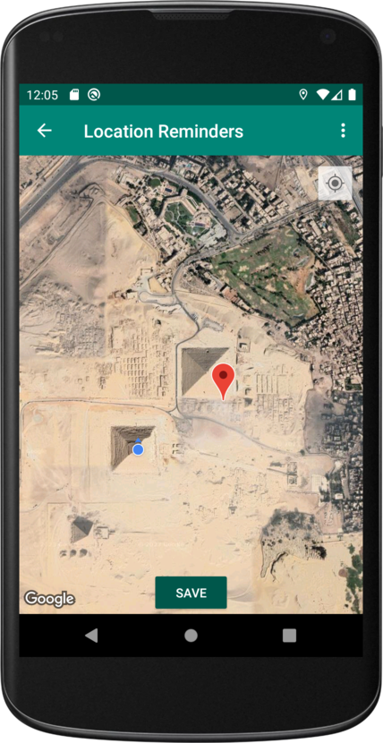
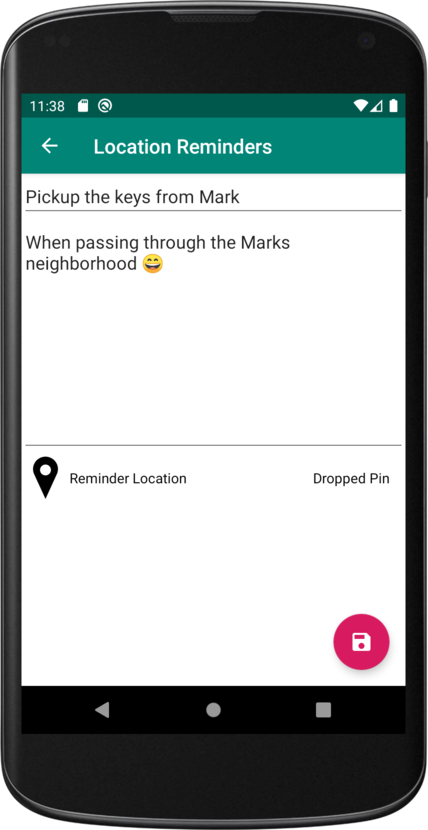
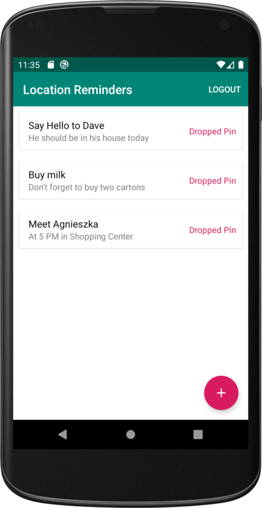
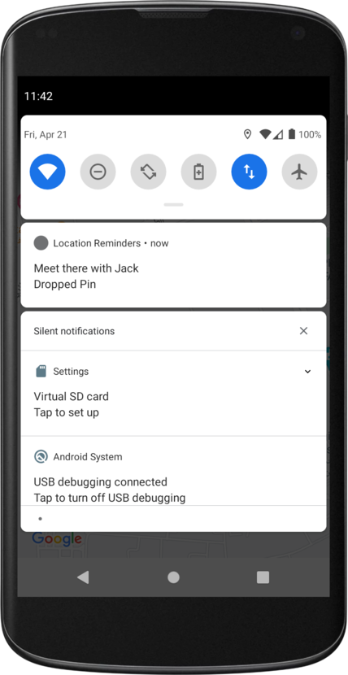
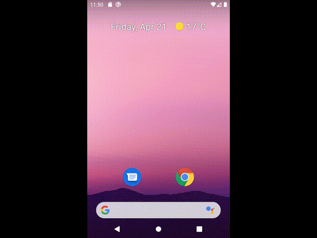
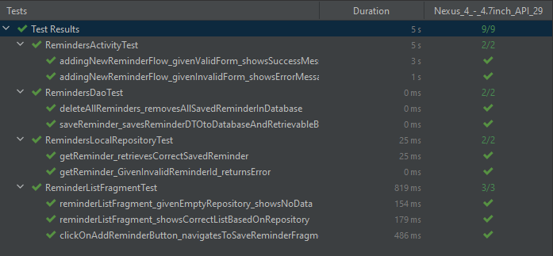
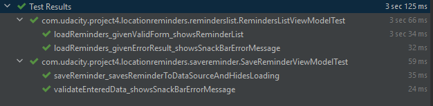

# Location Reminder 🗺️

In this project, I created a TODO list app with location reminders that remind the user to do something when the user is at a specific location. The app will require the user to create an account and login to set and access reminders.

App was created as the project for the Udacity nanodegree Android Kotlin Developer program.

## Features ✨

- User Authentication (Firebase)
- Firebase UI
- Map View
- MVVM
- Live Data
- Data Binding
- View Model
- Room
- Coroutines
- Navigation
- JobIntentService
- Notifications

## Testing 🧪

- Koin
- Espresso
- Mockito

## Project Milestones

### Login

Login screen implementation to ask users to login using an email address or a Google account. Upon successful login, navigate the user to the Reminders screen. If there is no account, the app navigates to a Registration (Signup) screen.

### Signup

Registration screen to allow a user to register using an email address or a Google account.

### Authentication

App enable the authentication using Firebase console and include Firebase UI dependency.

### Logout

Users can log out of the app and when the app starts again they are required to login first.

### Map View

Implementation of the Map view that shows the user's current location.

It should first ask the user's location access permission to show his/her current location on the map. App ensures that the location access is handled in cases of user denied access and is informed by the right error messages.

- POI: The app should ask the user to select a point of interest
- Map Styling
- Geofencing
- JobIntentService

### Reminder Creation

### Reminder notification

For each reminder, geofencing request is created in the background. It firess up a notification when the user enters the geofencing area.

### Testing

App includes Espresso and Mockito to test the app UI (each screen of the app) and Fragments Navigation. Testing follows the “Given, When, Then” pattern. Test method names includes the action and expected result of the test. Before and After are used to initialize the testing and clean up after finishing the test.

- Use MVVM and Dependency Injection
- Test the ViewModels, Coroutines, and LiveData
- FakeDataSource
- Test Framework
- Test DAO (Data Access Object) and Repository classes.

Instrumented Tests

Unit Tests

